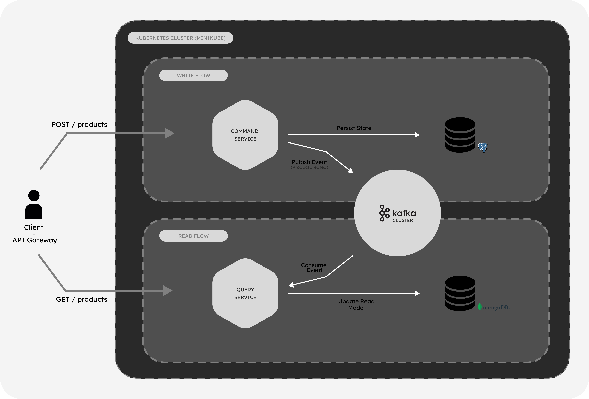

# 🚀 Distributed CQRS & Event Sourcing System

[](https://openjdk.org/)
[](https://spring.io/projects/spring-boot)
[](https://kafka.apache.org/)
[](https://kubernetes.io/)
[](https://www.postgresql.org/)
[](https://www.mongodb.com/)

A robust, cloud-native microservices architecture designed to demonstrate the implementation of **CQRS (Command Query Responsibility Segregation)** and **Event Sourcing** patterns. This project solves the scalability challenges of traditional monolithic CRUD applications by decoupling write operations (Commands) from read operations (Queries) using asynchronous event propagation.

---

## 🏗 Architecture Overview

The system is split into two distinct microservices that communicate asynchronously via an **Apache Kafka HA Cluster** running on Kubernetes.



### 1. Command Service (Write Side)
*   **Responsibility:** Handles high-throughput write operations and business logic validation.
*   **Tech:** Java 21, Spring Boot, PostgreSQL (Relational).
*   **Pattern:** Optimistic Locking & Idempotency.
*   **Output:** Publishes domain events (e.g., `ProductCreated`, `ProductPriceChanged`) to Kafka topics.

### 2. Query Service (Read Side)
*   **Responsibility:** Provides highly optimized, denormalized views for fast data retrieval.
*   **Tech:** Java 21, Spring Boot, MongoDB (NoSQL).
*   **Pattern:** Event Consumer (Idempotent listeners).
*   **Action:** Consumes events from Kafka to update Materialized Views in near real-time.

### 3. Infrastructure (DevOps)
*   **Orchestration:** Fully containerized deployment on **Kubernetes (Minikube)**.
*   **Resilience:** Implements **InitContainers** for dependency checking (Self-Healing).
*   **State Management:** Uses **StatefulSets** for Kafka brokers and Zookeeper to ensure data persistence and stable network identities.

---

## 🔥 Key Technical Features

*   **Event-Driven Architecture:** Complete decoupling between services ensuring eventual consistency.
*   **High Availability Kafka:** Configured with a 3-Broker Cluster, Zookeeper, and replication factor of 3 to simulate production-grade resilience.
*   **Idempotency Handling:**
    *   *Producer:* Transactional outbox pattern concepts to ensure events are published reliably.
    *   *Consumer:* Logic to handle duplicate events without corrupting the read state.
*   **Cloud-Native Deployment:**
    *   **Layered JARs:** Docker images optimized for faster builds and deployments.
    *   **K8s ConfigMaps & Secrets:** Externalized configuration for database initialization and environment management.
    *   **Health Checks:** Liveness and Readiness probes configured for zero-downtime updates.

---

## 🛠 Tech Stack

| Component | Technology | Description |
| :--- | :--- | :--- |
| **Language** | Java 21 (LTS) | Modern syntax, Records, Pattern Matching. |
| **Framework** | Spring Boot 3.5.7 | Spring Data JPA, Spring Data MongoDB, Spring Cloud Stream (Kafka). |
| **Messaging** | Apache Kafka | 3 Brokers + Zookeeper (Confluent Images). |
| **Database (Write)** | PostgreSQL 15 | Relational integrity for the Command model. |
| **Database (Read)** | MongoDB | Flexible schema for the Read model (Denormalized views). |
| **Containerization** | Docker | Multi-stage builds using Layered JAR approach. |
| **Orchestration** | Kubernetes | Deployments, Services (LoadBalancer/ClusterIP), StatefulSets, PVCs. |

---

## 🚀 Getting Started

Follow these steps to deploy the entire ecosystem on your local machine using **Minikube**.

### Prerequisites
*   Docker Desktop & Minikube installed.
*   `kubectl` CLI tool.
*   Java 21 JDK.

### Step 1: Start Minikube with Sufficient Resources
The Kafka cluster requires significant memory to run 3 brokers and Zookeeper effectively.
```
minikube start --memory=6144 --cpus=4
```

### Step 2: Build & Load Images
Instead of pushing to a remote registry, we build the images locally and load them directly into Minikube's internal cache.

1. Build images on your host machine
```
docker build -t command-service:latest -f CommandService/Dockerfile .
docker build -t query-service:latest -f QueryService/Dockerfile .
```

2. Load the images into Minikube
```
minikube image load command-service:latest
minikube image load query-service:latest
```


### Step 3: Deploy to Kubernetes
This command sets up the Namespace, Databases, Kafka Cluster, and Microservices.

```
kubectl apply -f k8s/
```


### Step 4: Watch the "Self-Healing" Magic
The services utilize **InitContainers** to wait for Zookeeper, Kafka, Postgres, and Mongo to be fully ready before starting.

```
kubectl get pods -n cqrs-system -w
```

*Wait until all pods status is `Running`.*

### Step 5: Expose Services
To access the APIs via `localhost`, create a tunnel:

```
minikube tunnel
```

## 📡 API Reference
Explore and test the endpoints using our ready-to-use Postman Collection.

[](https://documenter.getpostman.com/view/26712641/2sB3dSQUdV)

## Author
**Agustin Marani**

*Software Engineer | Java & Cloud Architecture Enthusiast*

<a href="https://www.linkedin.com/in/agustinmaranidev/">
  
</a>
